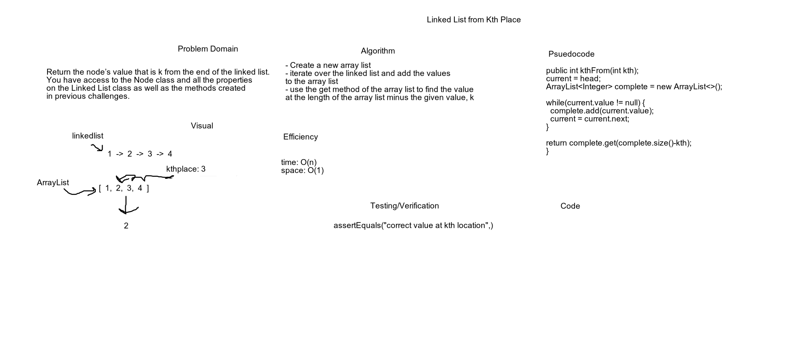
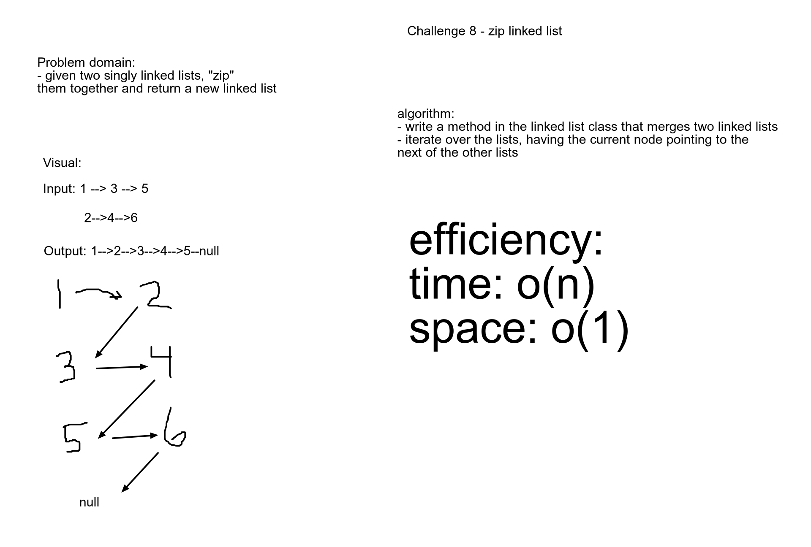

# Singly linked list

## Challenge:

need to create a LinkedList.Node class with properties for the value stored in the LinkedList.Node and pointer to next LinkedList.Node

In the linkedList class, include a head property

define a method called insert that takes any value as an argument and adds a new node with that value to the head of the list

define a method called includes that takes any value as an argument and returns a boolean if that value exists as a node

 define a method called toString that returns a string of all the values in the linked list
format: "{ a } -> { b } -> { c } -> NULL

Approach:

# tutorials used: 
https://www.youtube.com/watch?v=ch1uQeu0PVY
https://www.youtube.com/watch?v=YQQio9BGWgs

## Day 2: 

Challenge: 
- Add a method that find the value at the kth-from-end of the linked list

Approach: 

## Day 3:

Challenge: add a method that will "zip" together two linked lists

Approach:

