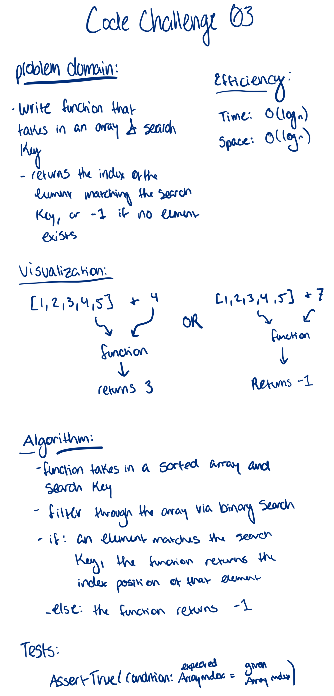

# Reverse an Array

## Challenge
Reverse and array without using any build in Java functions

## Approach & Efficiency

## Solution
TBD

# Challenge 3: Binary Search

## Description: 

use a binary search algorithm that takes in an array and a search key, and returns the index of the element matching that search key

## Approach: 

- Loop over the sorted array, checking if the search key is higher or lower than the mid value
- decrease the number of elements searched by half based on whether the search key is higher or lower than the mid value
- repeat until the search key matches the mid value and return the index
- return -1 if no match is found

## Solution: 

