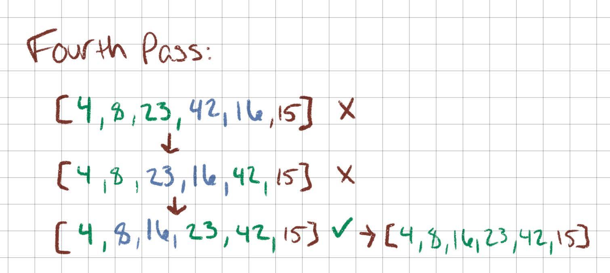
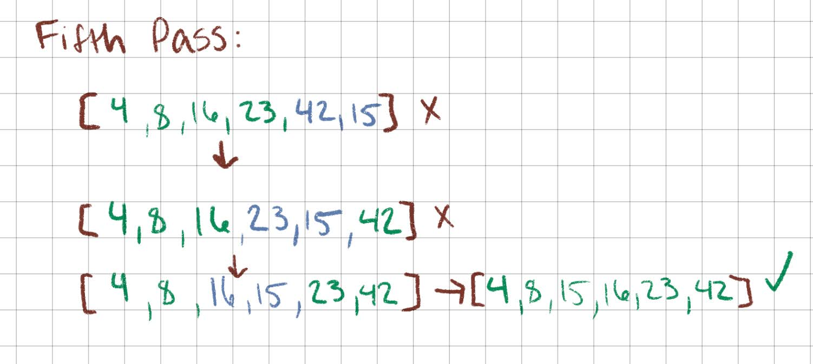

# Insertion Sort:

## What is an Insertion Sort Algorithm?

The Insertion Sort algorithm traverses an array, taking the current element and inserting it into its appropriate place in the "sorted" sublist. 

## Pseudo Code:

````
  InsertionSort(int[] arr)
  
    FOR i = 1 to arr.length
    
      int j <-- i - 1
      int temp <-- arr[i]
      
      WHILE j >= 0 AND temp < arr[j]
        arr[j + 1] <-- arr[j]
        j <-- j - 1
        
      arr[j + 1] <-- temp

````

## Process:

Let's consider this example array:
````
let arr = [8,4,23,42,16,15];
````

At completion, we expect the array to be sorted in ascending order.


- This pass compares 8 against 4. 
- 4 is less than 8 so it inserts 4 to the left of 8
- There is nothing on the other side of 4 to compare so it moves to the next pass


- This pass compares 8 against 23. 
- They are already in the correct place so it moves to the next comparison


- compares 23 against 42
- They are already in the correct order so it moves on



- compares 42 against 16.
- 16 is less than 42 so it will need to be moved. 
- looks at the number to the left of 42, which is 23
- 16 is less than 23 to it looks at the next number, which is 8
- 16 is not less than 8 so it inserts 16 to the right of 8



- Compares 42 against 15
- 15 is less than 42 and to the right so  it will need to be moved
- looks at the number to the left of 42, which is 23
- 16 is less than 23 to it looks at the next number, which is 16
- 15 is less than 16 so it looks at the number to the right of 16, which is 8
- 15 is not less than 8 so 15 is inserted to the right of 8. 
- The array is now fully sorted

## Efficiency:

- Maximum time efficiency is O(n)^2 (for a fully reversed array)
- Space efficiency is O(1)


