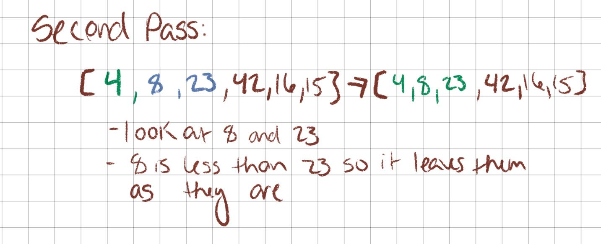

# Insertion Sort:

## What is an Insertion Sort Algorithm?

The Insertion Sort algorithm traverses an array, taking the current element and inserting it into its appropriate place in the "sorted" sublist. 

## Process:

Let's consider this example array:
````
let arr = [8,4,23,42,16,15];
````

At completion, we expect the array to be sorted in ascending order.





