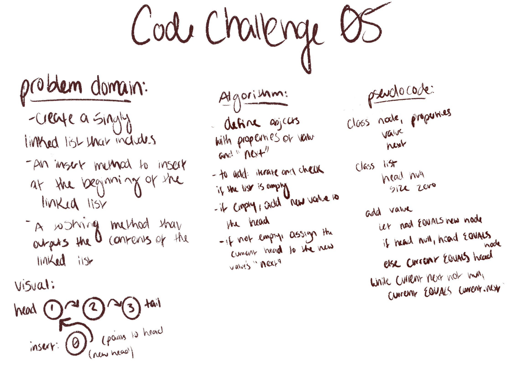
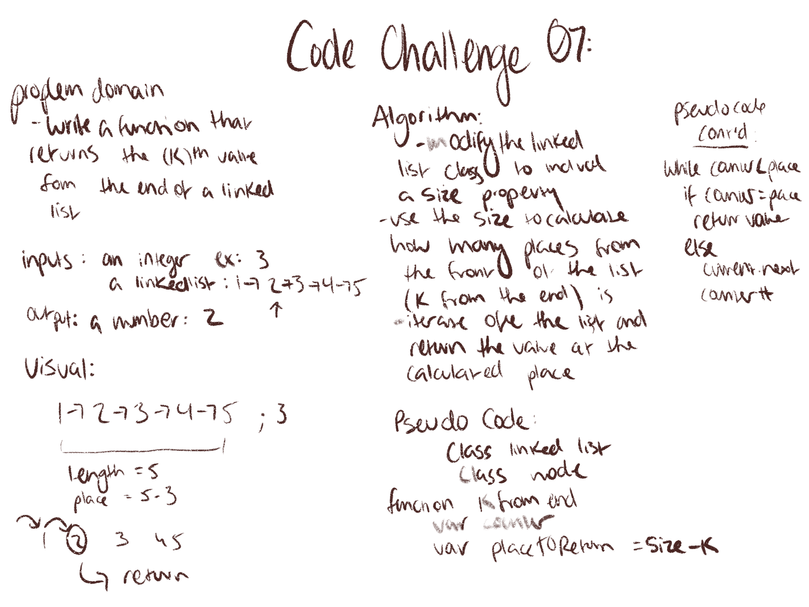
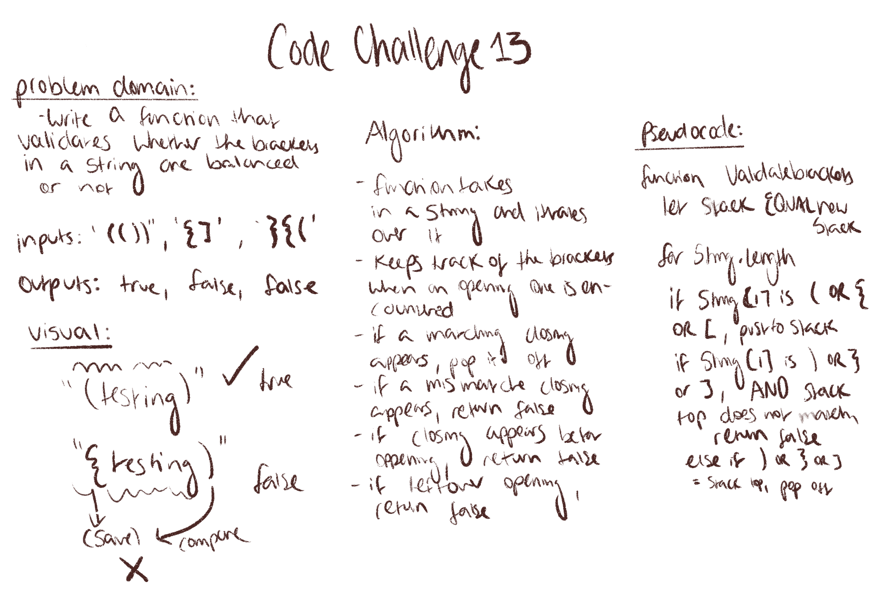

# Code Challenges: contents

## Challenge 01:
- reverse an array without using any built in methods

## Challenge 02: 
- Write a function without using any built in js methods that takes in an array and a value, and inserts the value at the middle index

## Approach:

## Challenge 03:
- Write a binary search algorithm that takes in a sorted array and a search key and returns the index position of the element matching the search key, or -1 if the element does not exist.

## Approach:

## Challenge 04:

## Challenge 04:
- Write and implementation of linked list without using and build in javascript methods
- Write an add method for your linked list class that adds a new node to the head of your linked list
- write a toString methods that prints the linked list to the console in this format: {a}->{b}->{c}->NULL

### Approach:

## challenge 05:
- update your linked list class to include the following methods:
- includes, which takes any value as an arguements and returns a boolean depending on whether the value exists as a node on the list

## Challenge 06:

### approach:

## Challenge 07: kth from end
- write a function that takes in a number (k) and returns the value k places from the end of the linked list

### approach:

## Challenge 08: ll zip

- write a function that takes in two linked lists as arguements and 'zips' them together

### approach:

## Challenge 08: Implement a Queue Using Two Stacks

## Challenge 9: Whiteboard Interview

## Challenge 11: Pseudoqueue

- implement a queue using two stacks

## Challenge 13: Multi-bracket-validation:
- Write a function that takes in a string as its only argument, and returns a boolean representing whether or not the brackets in the string are balanced. There are 3 types of brackets:

Round Brackets : ()
Square Brackets : []
Curly Brackets : {}

### Approach: 

