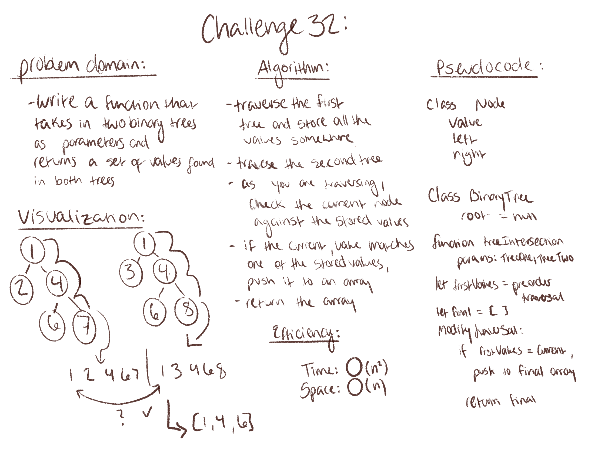

# Challenge 32: Tree intersection

## requirements: 
- Write a function called tree_intersection that takes two binary tree parameters.
- Without utilizing any of the built-in library methods available to your language, return a set of values found in both trees.

## Approach & efficiency:
- Traverse first tree and store all the values
- Traverse second tree and check each value at current node against the stored values
- push the matches to an array
- return the array
- Time efficienty: O(n^2)
- space efficiency: O(n)

## Solution: 

(Co-authored with Bryant Davis)

